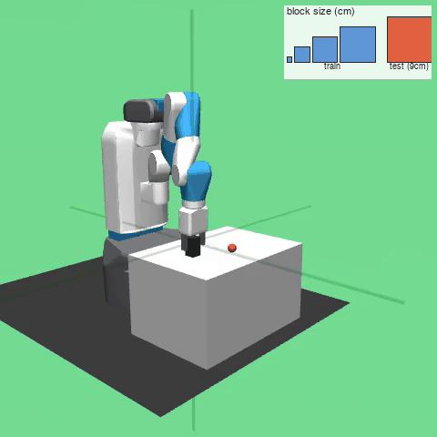

# think-then-act

Training a robot arm to plan a sequence of actions using images of the environment.

The arm lives in the **FetchPickAndPlace-v3** MuJoCo environment. The task is to pick up a block and move it to a target location.

## 🔬 Key Engineering Insights
For a complete breakdown of the trials, errors, and architectural insights, check out the lab notes:

* **[Why text tokens are a bad action representation for continuous control](./docs/journey.md#why-text-tokens-are-a-bad-action-representation-for-continuous-control)** — A breakdown of why tokenizing continuous float numbers and autoregressive order dependencies (like P(Δx) · P(Δy | Δx)) fail for robot arm control.
  
* **[Slow and fast system - not a new idea](./docs/journey.md#how-to-redesign-architecture-with-vlm-for-continuous-control)** — I fine-tuned with LoRA (updating Q/K/V/O attention modules) and learned at least 4 things
* 
* **[Problems when fine-tuning with LoRA a VLM to pick the next-low level sub-policy](./docs/journey.md#problems-when-fine-tuning-with-lora-a-VLM-to-pick-the-next-low-level-sub-policy)** — Hierarchical architecture (working on the low-level controller; high-level VLM)

---
## How it works

The low-level MLP was first trained with GRPO, but it kept collapsing partway through training. PPO worked instead, maybe because the reward is dense?

Domain randomization: The `close_gripper` low-level policy was trained with randomized block sizes (1–8cm) so it
generalizes past one fixed cube. Below: gripping a 9cm-tall block, which is taller than anything seen
during training.

Rollouts are run across 8 CPUs (8 MuJoCo episodes at once to collect data), then pause them while 1 core does the quick PPO update step, then repeat. PPO update step takes a split second, so it makes no sense to start rolling out in parallel.

---

## Stack

| Component | Choice |
|-----------|--------|
| Simulator | MuJoCo 3.1.6 + gymnasium-robotics 1.3.1 |
| Environment | FetchPickAndPlace-v3 (headless OSMesa) |
| Policy | Qwen2-VL-2B-Instruct |
| RL algorithm | GRPO + LoRA (peft 0.12.0) |
| Compute | Modal serverless (A10G for training, T4 for eval) |
