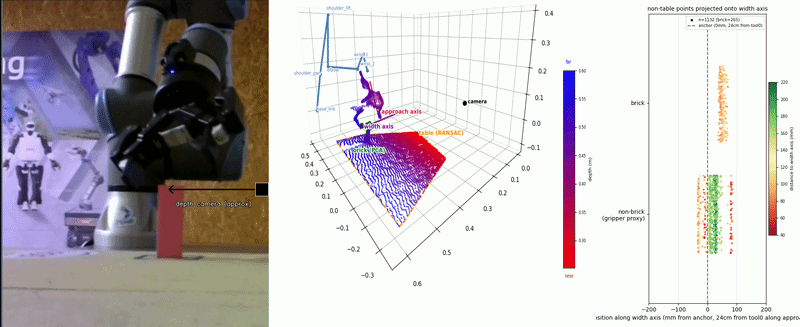

# Journey

Notes from building this project — the dead ends and what they turned out to mean, written up as I go. 

## Using Modal is amazing

Over the past few months, I've been using Modal to build infrastructure for a robotics RL project where training and deploying models quickly outgrew local hardware. Modal fills a crucial gap when a task exceeds what you can run locally (in my case, a 2016 Mac) without standing up a full infra pipeline.

I was really impressed with how quickly it spins up containers. Deploying a VLM app, my first cold start took ~4 minutes (pulling the image, loading weights); every rebuild after that was under 60 seconds.

I also find it cool how you can choose which specific functions run remotely vs. locally, function by function, not your whole app.

Every month you get free credits which are not enough to pretrain anything from scratch, but enough to try something cool. For example, I used mine to LoRA-fine-tune a 2B-parameter Qwen2-VL model for high-level goal selection in a robot-arm RL pipeline.

For the math: Modal's free Starter tier gives $30/month in credits. The A10G I trained on runs ~$1.10/hr, so that's roughly 27 hours of GPU time a month, free. Perfect for running lightweight experiments without taking on infra overhead.

## Why text tokens are a bad action representation for continuous control

One of the first things I tried on the robot arm was having a vision-language model (Qwen2-VL) look at a camera frame and directly output the next move as Cartesian displacements `<Δx, Δy, Δz>` as text tokens, trained end-to-end with GRPO.

It didn't work, and it took a while to figure out whether this was a training, model, or capacity problem.

Numbers are tokens, and continuous numbers tokenize inconsistently. `0.2` is `'0'`, `'.'`, `'2'`, while `0.19` is `'0'`, `'.'`, `'1'`, `'9'`. A small difference like 0.01 results in two completely different token sequences. You can avoid this by binning the action space into discrete bins — each bin gets an integer from 0 to N, and the VLM predicts a bin id instead of a float.

That doesn't solve the underlying issue, though. Autoregressive models generate tokens sequentially, conditioning each dimension on whatever came before it: `P(Δx) · P(Δy|Δx) · P(Δz|Δx,Δy)`. This creates an artificial order dependency between action dimensions that have no real reason to depend on each other.

For example, if `(Δx=8, Δy)` succeeds and `(Δx=9, Δy)` fails, the model learns two different things about the *same* `Δy` — that it was good when conditioned on `Δx=8`, and bad when conditioned on `Δx=9` — instead of learning that `Δy` was simply good, independent of `Δx`.

It turned out I was using the wrong action representation (floats, then bins), and the wrong way to use a VLM for continuous control in the first place.

## Problems when fine-tuning with LoRA a VLM to pick the next-low level sub-policy

I fine-tuned a VLM to look at a frame and pick the next low-level sub-policy to fetch a block.

For example:
- gripper far from the block → align across x/y
- gripper just above the block → descend and close fingers

The VLM outputs a reasoning trace (<think>) followed by a subgoal label (<action>) from a closed vocabulary.

I fine-tuned with LoRA (updating Q/K/V/O attention modules) and learned at least 4 things:

1. Format learning is fast (LoRA’s superpower)
Getting the VLM to strictly follow the output format was the easiest win. This makes sense because this is the main usage for LoRA fine-tuning - the model has the right concepts embedded in its activations, you’re just asking it to formulate it in a certain way.

2. When it comes to arithmetics, the VLM fails in unpredictable ways.
The model could correctly calculate 2D Euclidean distances in its reasoning trace, but then confidently declare that 16 is greater than 20.

3. The validation loss sometimes just shows gradients flow
The loss function confounds three different things: token syntax (<think> tags), reasoning correctness, and final label accuracy. Watching val loss go down does not mean you're done.

4. Models, like us, love shortcuts
Looking at the confusion matrix exposed a sneaky hack:
- align_xy reasoning often contained "I need to move over to the block first." 
- move_to_target was the only subgoal starting with the word "move_".
So why not misclassify align_xy as move_to_target and contradict your own calculations?

As always with complex data, quantitative metrics can lie; qualitatively inspecting model traces is where real debugging happens.

## Measuring gripper-to-brick distance from a point cloud, without color or calibration

The goal of the robot arm is to pick up a vertical brick. For perception, I have a depth camera that generates 3D point clouds. The goal is to guide the gripper to correctly close its fingers around the brick, and to quickly block the control policy if it plans a move that would topple the brick.

To process the point cloud I first use RANSAC to find the table, then PCA to find the brick. Finding the brick was not trivial, even though it's static and has a simple shape.

The harder question: how do I precisely measure the distance between the gripper's fingers and the brick? Initially I wanted to further cluster the points, identify two clusters belonging to the two fingers, and track the distance between the axis spanning those two clusters and the brick. That didn't work — I couldn't reliably identify the two fingers as separate clusters. My best guess is that the wrist angle, combined with the material the gripper is made of, changes how many points land on it and whether the two fingers show up merged or separated in a given frame.

So I switched to using the robot's own internal state via forward kinematics instead — which trades that unreliability for sensitivity to calibration errors instead. The clip below shows the projection: points from the brick cluster and the non-brick cluster (noise or gripper, undistinguished at this stage — a proxy for gripper position) projected onto the gripper's width axis, tracking their spread and proximity to the brick over time.

The idea going forward: when the brick's points and the outer edge of the non-brick points sit at roughly the same distance along this axis, that's the gripper's fingers positioned around the brick aka sa safe regime. If the brick gets too close to those outer points, that's the regime that should trigger a quick stop. Getting there required a lot more precision than this projection alone gave — see `scripts/extract_gripper_brick_geometry.py` for where that ended up: RANSAC-based table/wall removal, PCA-based brick and finger clustering, and using the forward-kinematics prediction as a prior to pick the right point cluster as "the gripper" instead of guessing from geometry alone.
